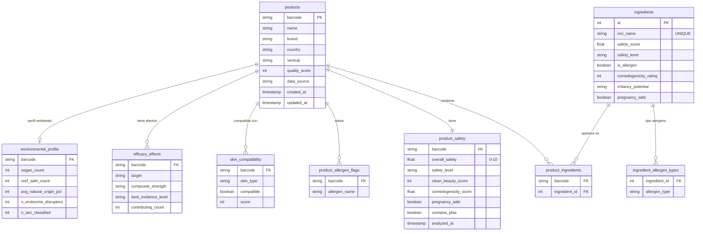

# Análisis de Datos INCI — Comparación y Diseño de Base de Datos

## Fuentes de datos

| Archivo | Endpoint | Registros | Descripción |
|---|---|---|---|
| `inci_results_entorno_prueba.jsonl` | `/api/web/products/{barcode}` | 64,237 | API completa, datos ricos |
| `inci_results_pantalla_inicio.jsonl` | `/api/web/demo/products/{barcode}` | 64,237 | API demo, datos reducidos |
| `inci_results_dom_entorno_prueba.jsonl` | DOM scraping | 41,248 | Solo barcodes encontrados, campos exclusivos |

---

## Volumen y cobertura

| Métrica | EP (entorno prueba) | PI (pantalla inicio) | DOM |
|---|---|---|---|
| Total registros | 64,237 | 64,237 | 41,248 |
| 404 / no encontrado | 22,989 (35.8%) | 22,990 (35.8%) | — |
| Productos válidos | 41,248 (64.2%) | 41,247 (64.2%) | 41,248 |
| Con análisis completo | 18,723 (29.2%) | 18,723 (29.2%) | 18,723 (100%) |

> **Relación clave**: DOM solo contiene los barcodes que *sí se encontraron* en EP/PI.
> `DOM ⊆ EP_válidos = PI_válidos` — los tres datasets hablan de los mismos productos.

---

## Overlap de barcodes

| | Cantidad |
|---|---|
| Barcodes en EP y PI | 64,237 (idénticos) |
| Barcodes en los 3 datasets | 41,248 |
| Solo en EP o PI | 0 |

---

## Estructura JSON por fuente

### Campos exclusivos de cada fuente

| Fuente | Campos que no tiene la otra |
|---|---|
| **EP** (sobre PI) | `qualityScore`, `country`, `dataSources`, `weight`, `packaging`, `volume`, `manufacturer`, `createdAt`, `updatedAt`, `spf`, `certifications`, `skinType`, `usage`, `warnings`, `periodAfterOpening` |
| **DOM** (sobre EP/PI) | `efficacySummary`, `environmentalProfile`, `skinCompatibility`, `skinTypeRecommendations`, `compatibilityConflicts`, `allergenWarnings`, `pregnancyWarnings` |
| **PI** (sobre EP) | Ninguno — PI es subconjunto estricto de EP |

### Diferencias estructurales críticas

| Campo | EP | PI | DOM |
|---|---|---|---|
| `overallSafetyScore` | `0–10` (float) | `0–10` (float) | `0–100` (int) — escala diferente |
| `details.inci` | lista de strings | string único concatenado | — |
| `analysis` | idéntico | idéntico | no aplica |
| Ingrediente safety | `safetyScore` | `safetyScore` | `safetyRating` |
| Ingrediente alérgenos | `allergenTypes` (lista) | `allergenTypes` (lista) | `allergenType` (singular) |

> **Alerta**: `EP analysis == PI analysis` al 100% — mismas claves, mismos valores.
> PI no aporta nada que EP no tenga.

---

## Calidad de datos por campo

### EP — cobertura de campos de producto

| Campo | % con dato real |
|---|---|
| `name`, `brand`, `barcode` | ~100% |
| `category` | 54.5% |
| `usage` | 50.8% |
| `packaging` | 26.1% |
| `certifications` | 20.2% |
| `has_image` | 12.2% |
| `manufacturer` | 10.9% |
| `warnings` | 9.2% |
| `periodAfterOpening` | 7.8% |
| `skinType` | 1.5% |
| `spf` | 0.1% |

### DOM — cobertura de campos de ingrediente

| Campo | % con dato real |
|---|---|
| `isAllergen`, `safetyRating`, `isPregnancySafe`, `comedogenicity` | ~100% |
| `allergenType` | 10.3% |
| `vegan`, `reefSafe`, `fungalAcneSafe`, `photosensitivityRisk` | **0.0%** |
| `naturalOriginPercent`, `endocrineDisruptionRisk`, `carcinogenicityClass` | **0.0%** |
| `breastfeedingSafe`, `functions` | **0.0%** |

### DOM — cobertura de secciones de producto

| Sección | % con dato real |
|---|---|
| `skinCompatibility` | 100% |
| `efficacySummary.topEffects` | 28.6% |
| `overallSafetyScore` = 50 (valor por defecto) | **63.0%** — no confiable |

---

## Análisis: qué datos son más importantes

### Conservar

- **Ingredientes reconocidos** (`found=True`) con su `safetyScore`, `safetyLevel`, `isAllergen`, `allergenTypes` — núcleo del análisis
- **Scores de producto** de EP: `overallSafetyScore` (0–10), `cleanBeautyScore`, `comedogenicityScore`, `pregnancySafe`, `allergenFlags`
- **Identidad del producto** de EP: `barcode`, `name`, `brand`, `country`, `qualityScore`
- **`skinCompatibility`** de DOM (100% cobertura, exclusivo de esa fuente)
- **`efficacySummary.topEffects`** de DOM (28.6%, cuando existe es valioso)
- **`environmentalProfile`** de DOM (veganCount, reefSafeCount — aunque los campos por ingrediente son nulos, el resumen de producto sí tiene datos)

### Descartar

| Dato | Motivo |
|---|---|
| **Todo PI** | Subconjunto estricto de EP, mismo `analysis`, sin valor extra |
| **Registros 404** | Sin producto, sin datos |
| **`found=False`** en ingredientes | Ruido OCR: instrucciones de uso mezcladas con nombres INCI |
| **DOM `overallSafetyScore`** | 63% son exactamente `50` (valor por defecto) — no confiable |
| **Campos DOM de ingrediente** (`vegan`, `reefSafe`, `photosensitivity`, etc.) | 0.0% de cobertura real |
| `rawInci` | Redundante con `parsedIngredients`, más ruidoso |
| `manufacturer`, `skinType`, `spf`, `periodAfterOpening`, `volume` | Cobertura < 12% |
| `details.barcode` | Duplicado del barcode raíz |

---

## Estructura de base de datos propuesta

### Decisiones de diseño

- **Sin tabla PI** — datos 100% redundantes con EP
- **`ingredients` es catálogo normalizado** — 1 fila por nombre INCI único; si un ingrediente actualiza su `safetyScore`, se propaga a todos los productos automáticamente
- **`product_safety` separada de `products`** — permite actualizar scores sin tocar la identidad del producto
- **DOM `overallSafetyScore` no se almacena** — 63% son valor por defecto (50), el score confiable viene de EP
- **`skin_compatibility` y `efficacy_effects`** solo vienen de DOM (no existen en la API JSON)
- **`product_ingredients`** como tabla puente — permite queries como "todos los productos que contienen RETINOL" o "ingredientes más frecuentes en productos safe"

---

## Endpoints

| Fuente | Endpoint |
|---|---|
| Entorno de prueba (EP) | `https://inciapi.com/api/web/products/{barcode}` |
| Pantalla inicio (PI) | `https://inciapi.com/api/web/demo/products/{barcode}` |
